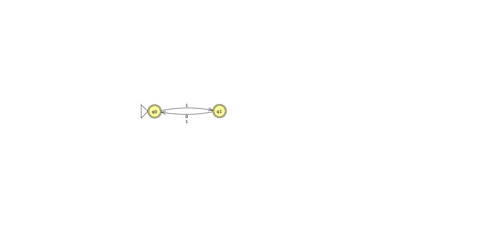
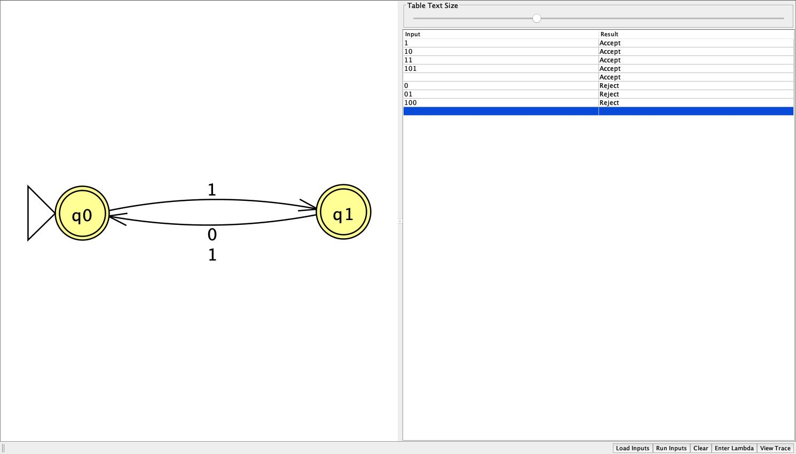
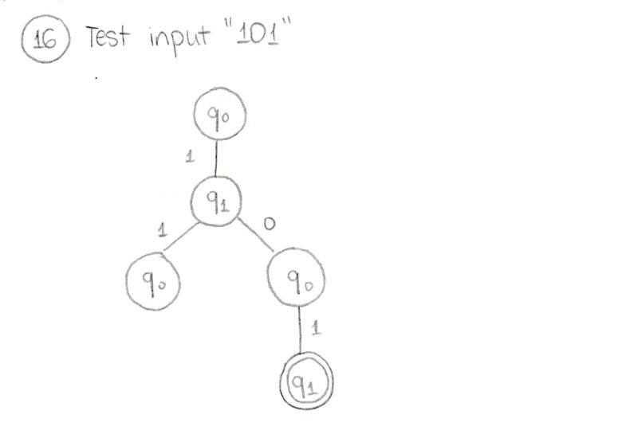
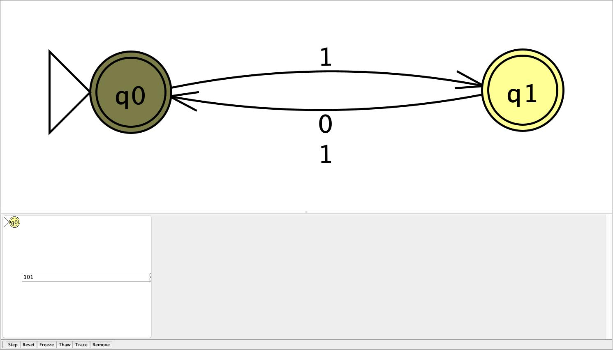
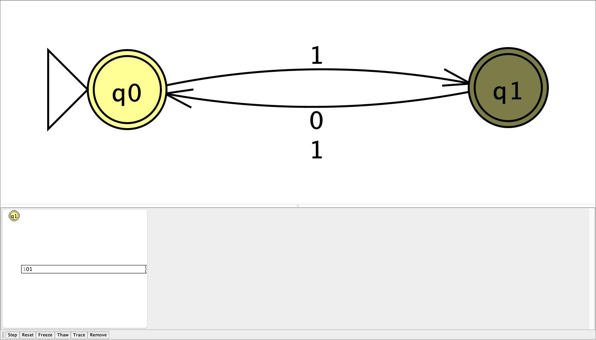
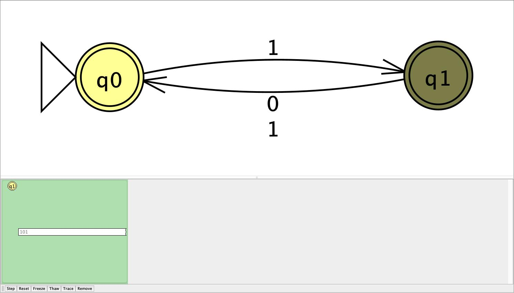

# Problem 16

```
{string s| every odd position of s is 1, starting at 1 in positional index } (e.g. 101 is in the lang.)
```

## NFA



`q0` is the start state, which is reached right after an empty string, or an even-position symbol. `q1` is reached right after a valid odd-position 1. Both are accepting, because the constraint is only to make sure that every odd position character is a 1. `q0` has no arrow on 0, so any 0 at an odd position dies and the string is rejected.

## Batch results



All 8 resutls matched the expected output: strings endning after a valid odd position index with 1 are accepted while those with any 0 at an odd position index are rejected.

## Hand-drawn computation tree & JFLAP transition

Example input: `101`

- Handrawn computation tree:


- JFLAP transitions:




