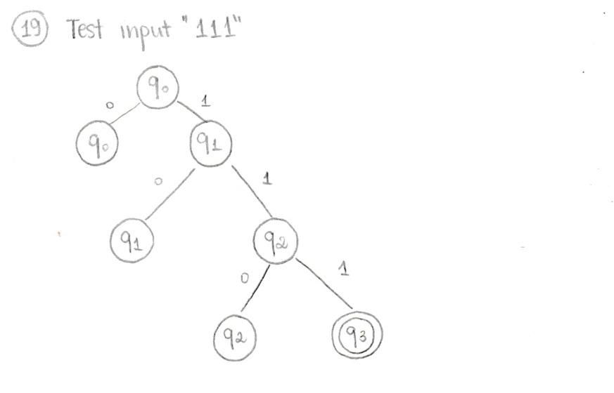

# Problem 19

```{ string s | s has 3k 1's, where k >= 1 }```

## NFA


Only `q3` is accepting, since k >= 1 excludes zero ones.

## Batch results


All results matched expected output: multiples of 3 ones (and none) are accepted while the rest are rejected

## Hand-drawn computation tree & JFLAP transitions

Example input: `111`

- Handrawn computation tree:


- JFLAP Transitions:


