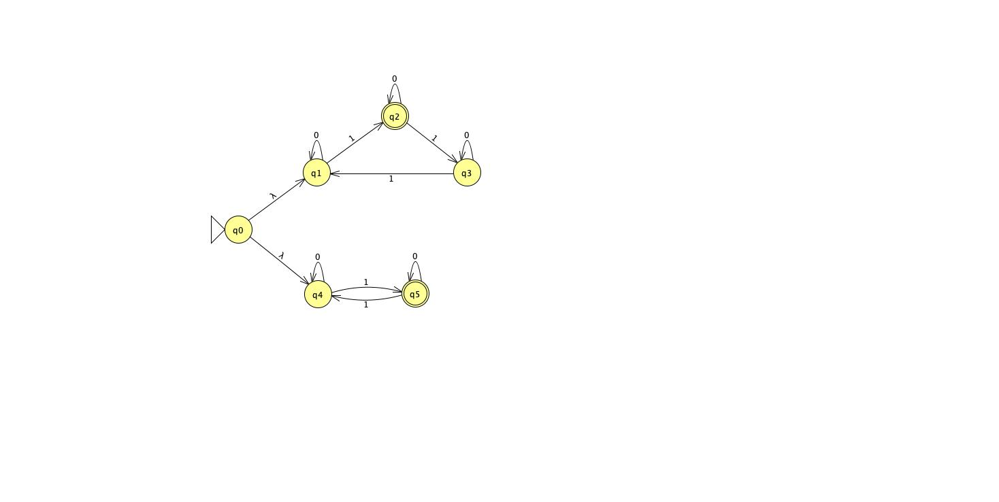
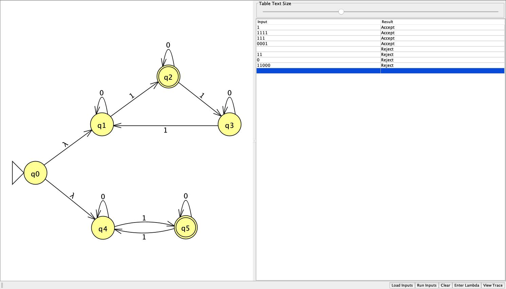
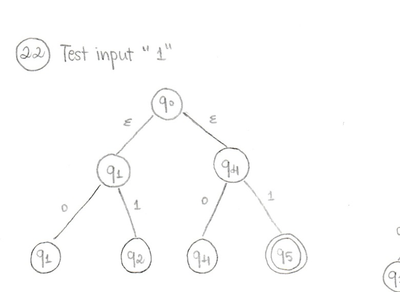
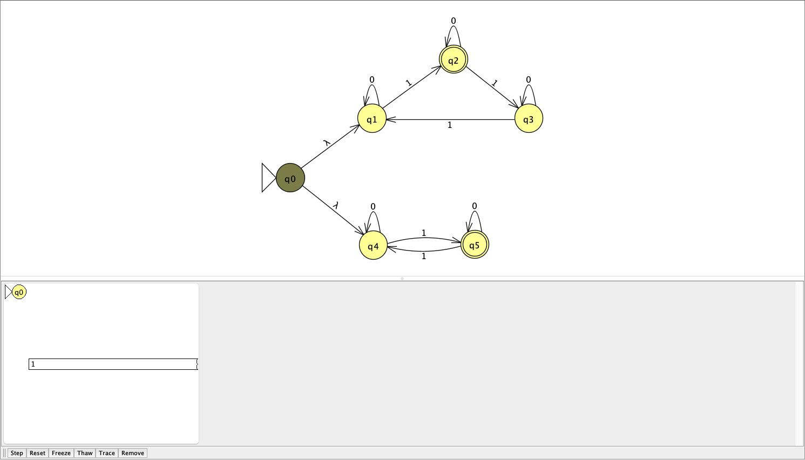
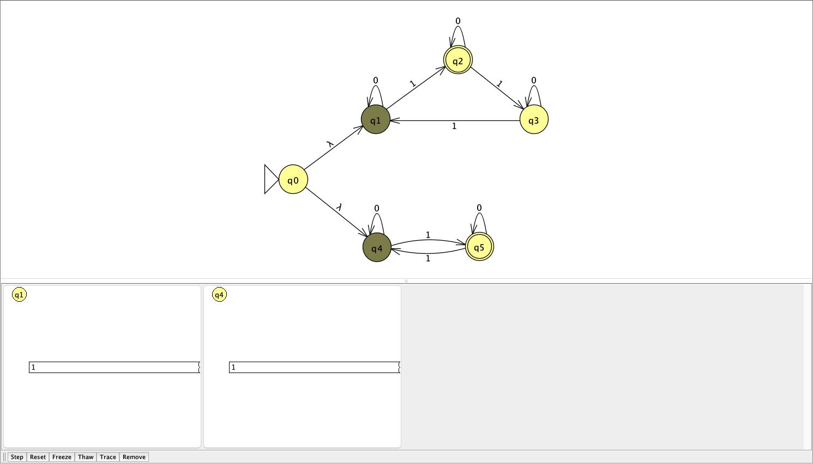
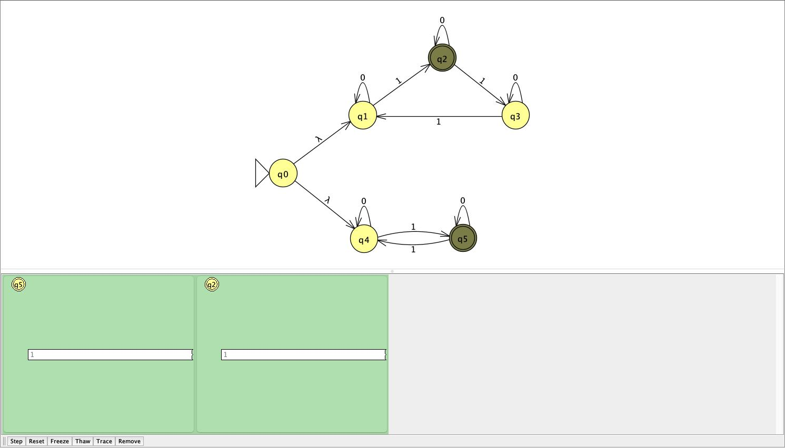

# Problem 22

```{ string s | s has 3k+1 number of 1's, where k >=0, or odd number of 1's }```

## NFA



Union of 2 sub-NFAs via `ε`: N1 accepts `3k + 1` 1's and N2 accepts an odd number of 1's. Either branch accepting means the whole NFA accepts.

## Batch results



All results matched expected output, including strings satisfying both conditions at once.

## Hand-drawn computation tree & JFLAP transitions

Example input: `1`

- Handrawn computation tree:


- JFLAP Transitions:



