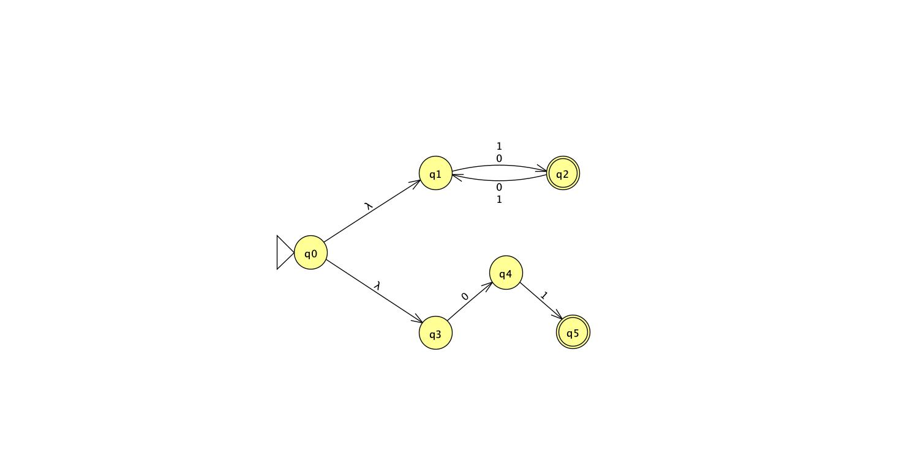
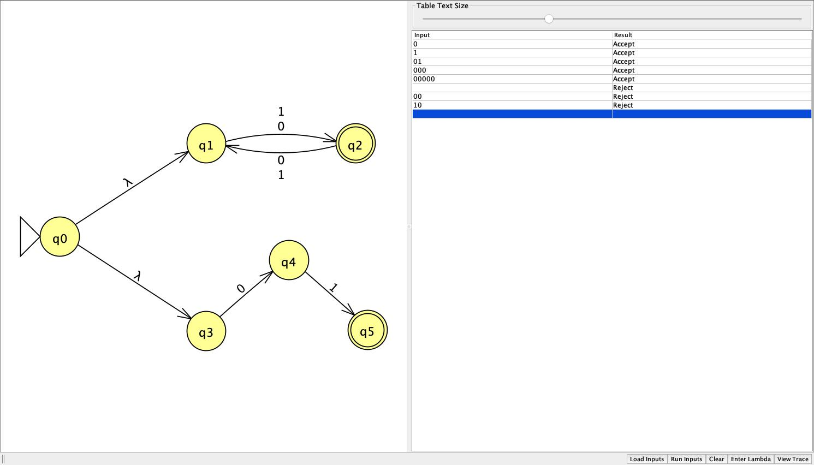
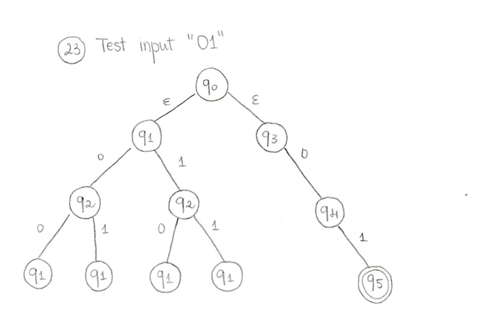
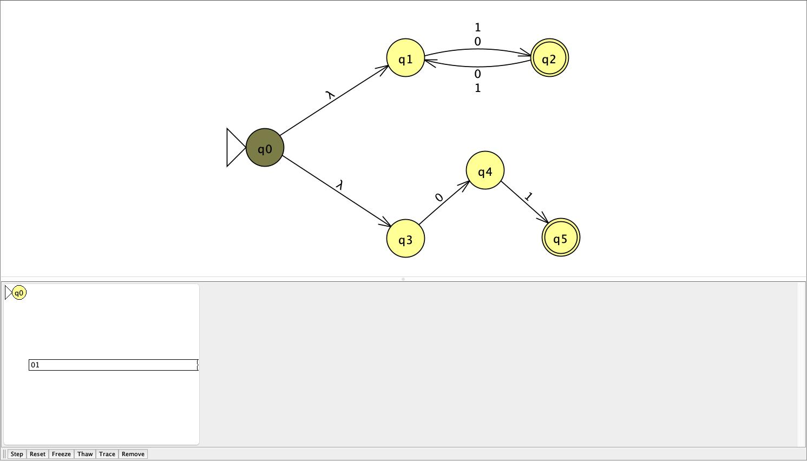
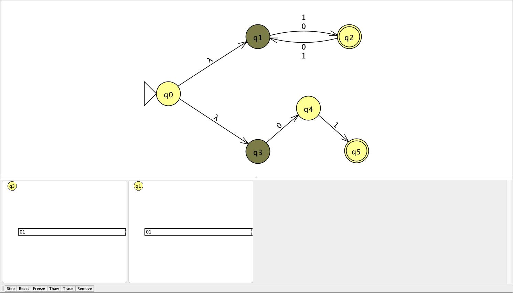
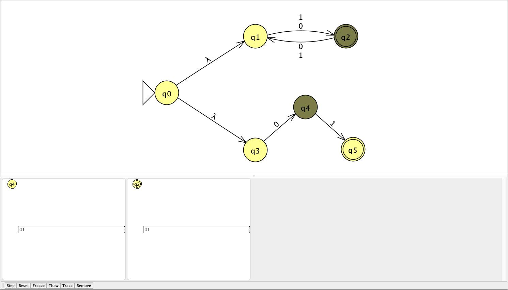
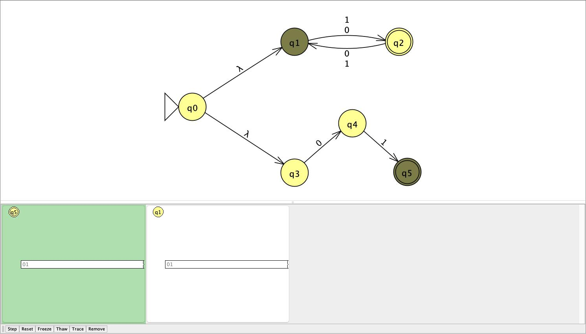
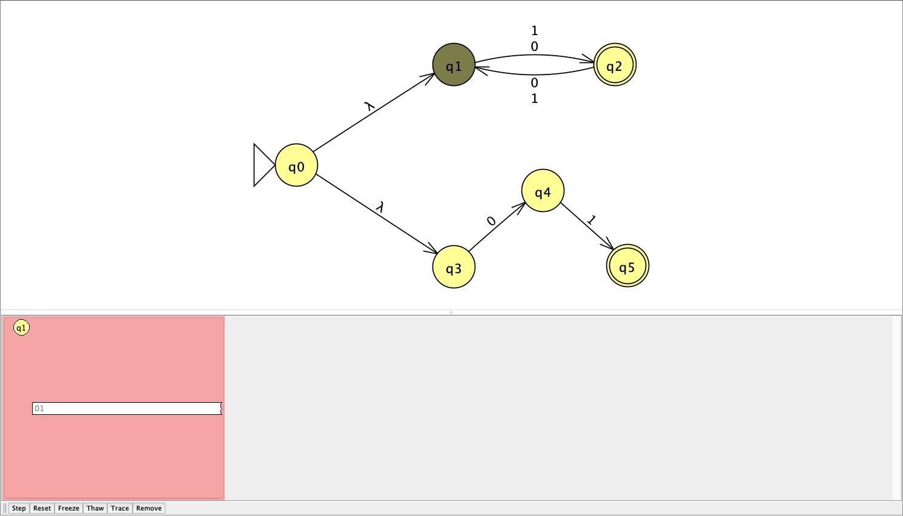

# Problem 23

```{ string s | s has odd length or s = 01 }```

## NFA



Union via `ε`: N1 accepts odd-length strings and N2 accepts only the exact string `01`. Either branch accepting means the whole NFA accepts.

## Batch results



All results matched expected output, including `01` itself.

## Hand-drawn computation tree & JFLAP transitions

Example input: `01`

- Handrawn computation tree:


- JFLAP Transitions:





