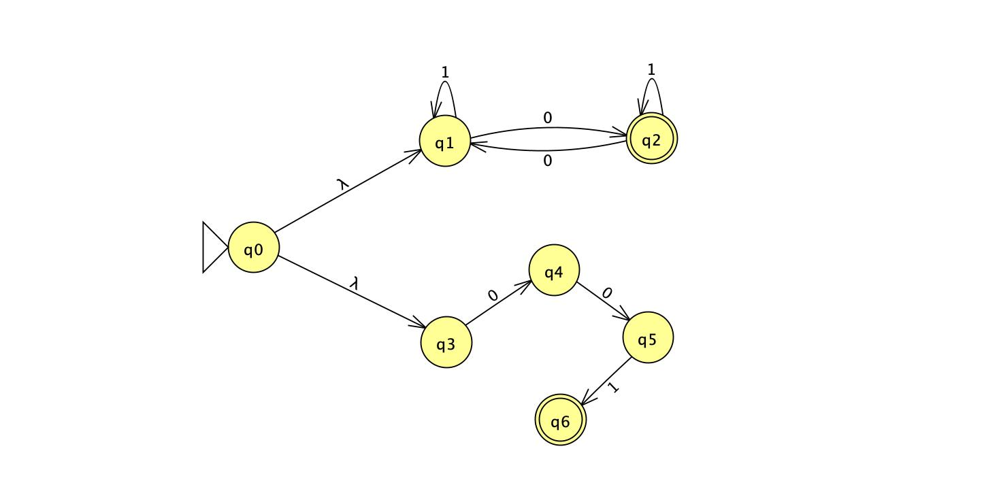
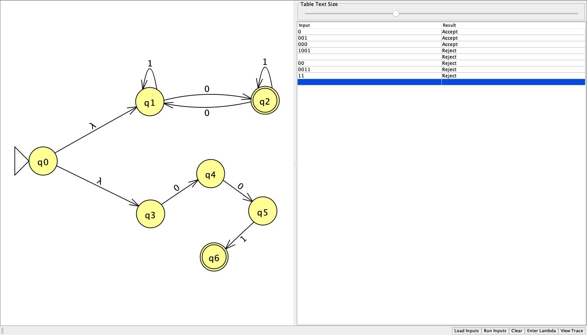
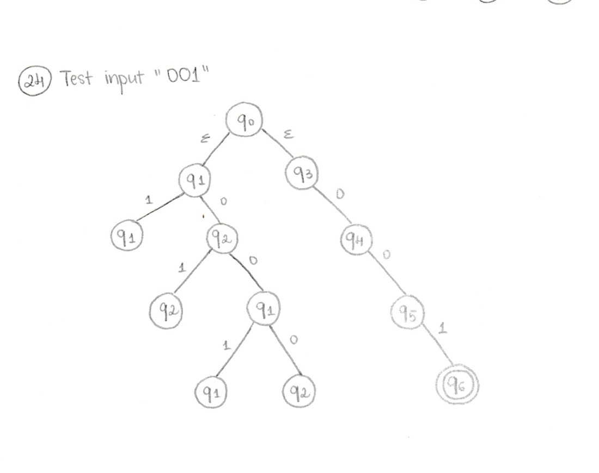
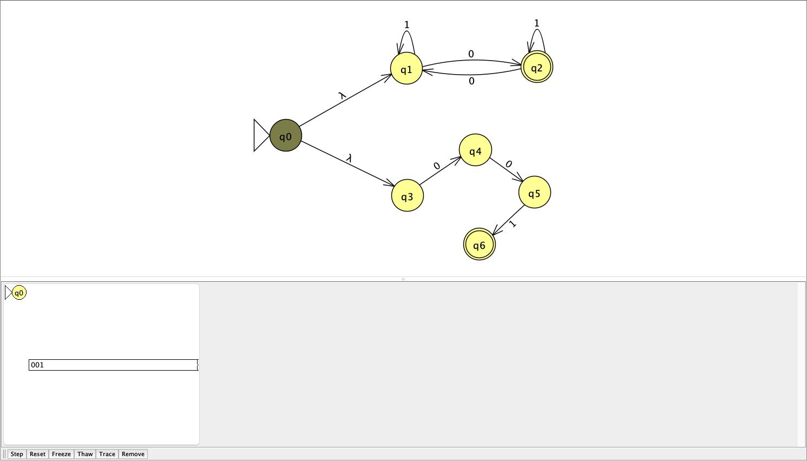
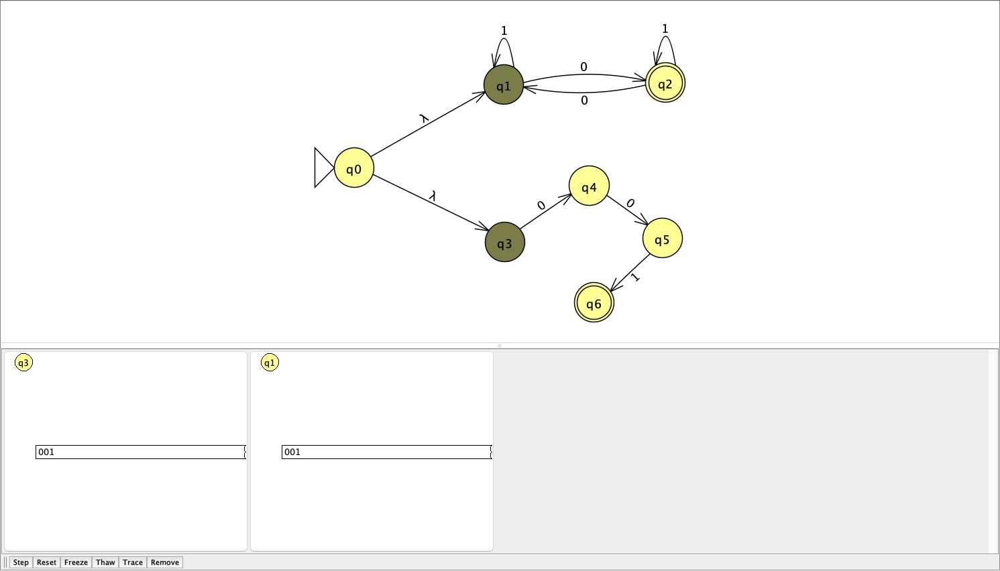
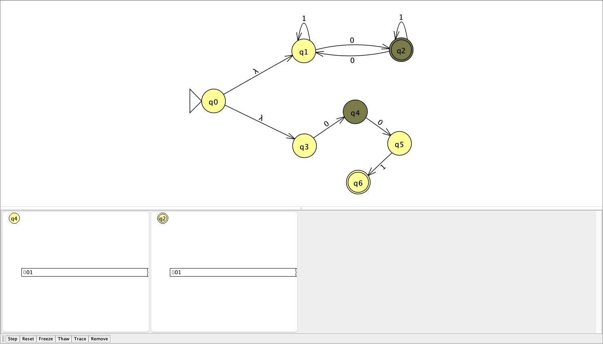
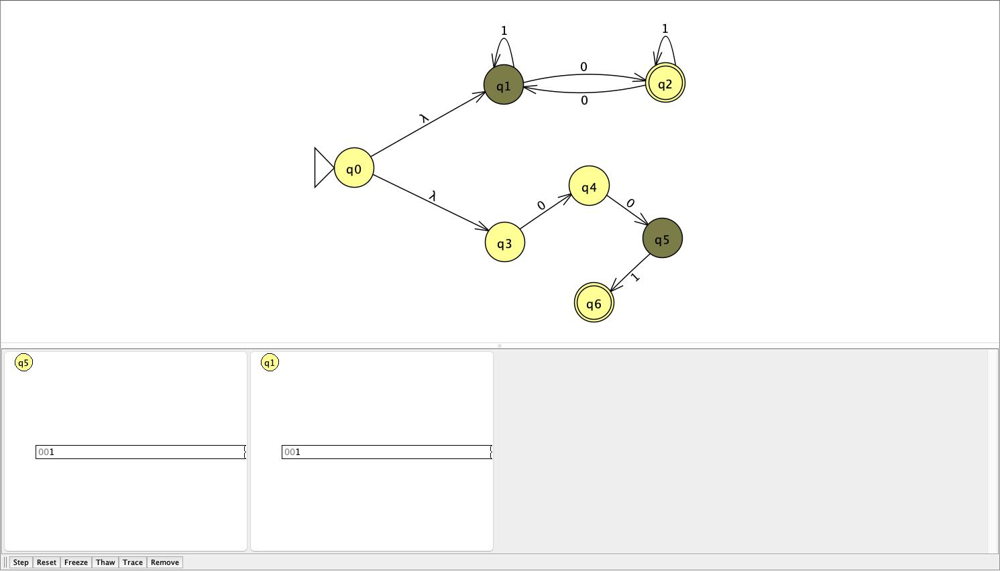
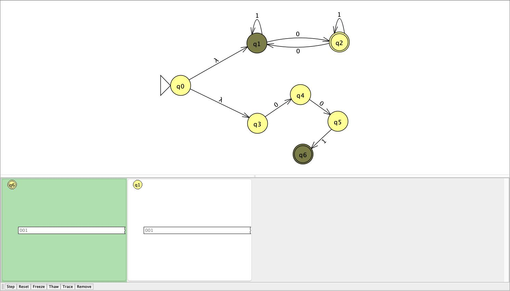
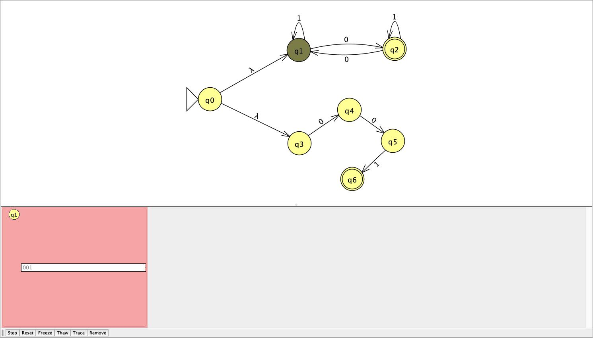

# Problem 24

```{ string s | s has odd number of 0's or s = 001 }```

## NFA



Union via `ε`: N1 accepts an odd number of 0's and N2 matches only the exact string `001`. Either branch accepting means the whole NFA accepts.

## Batch results



All results matched expected output, including `001` itself.

## Hand-drawn computation tree & JFLAP transitions

Example input: `001`

- Handrawn computation tree:


- JFLAP Transitions:






